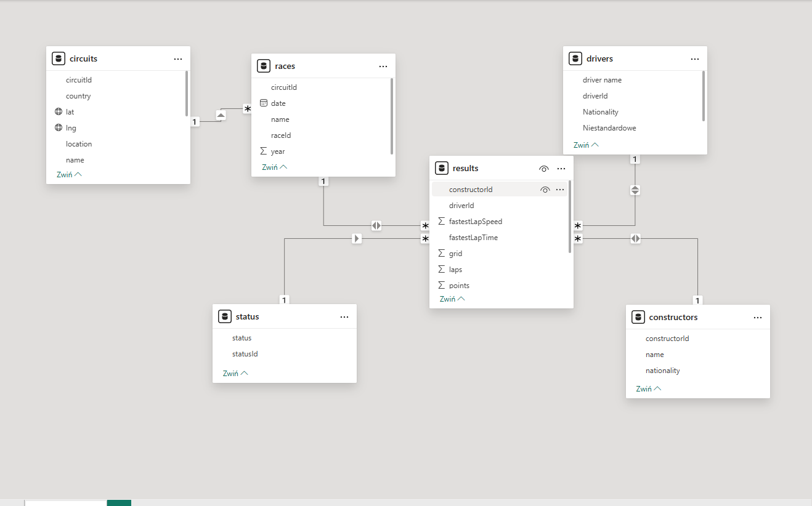
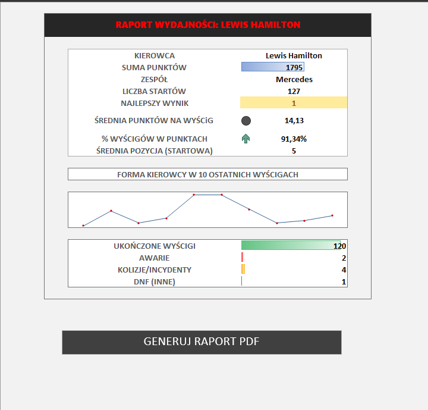
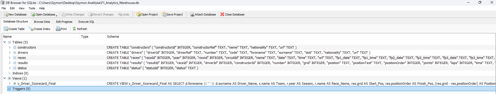
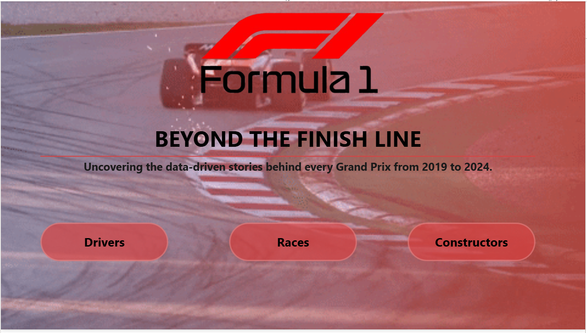
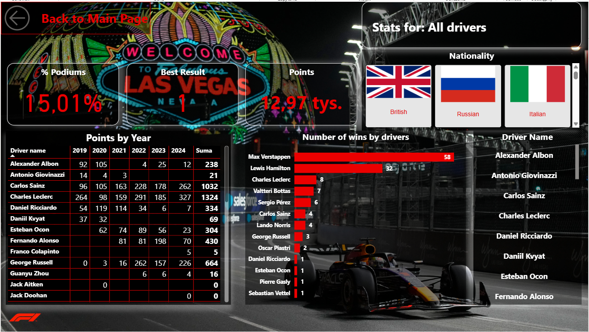
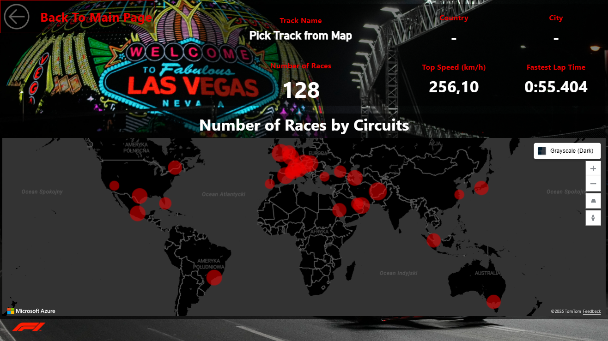
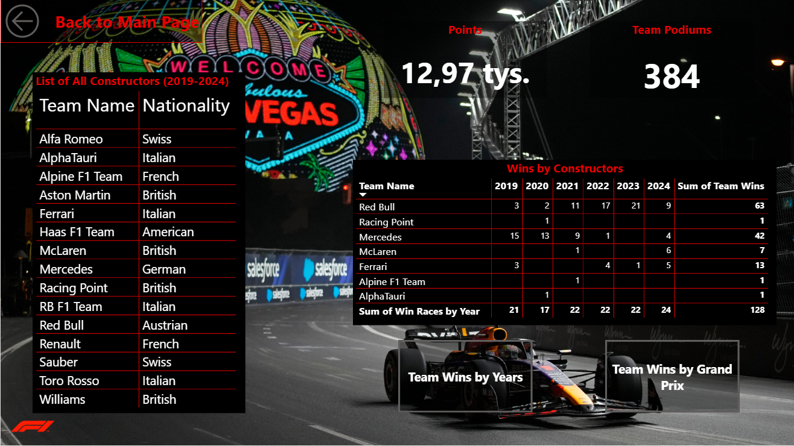

# F1-Performance-Ecosystem-SQL-Excel-Power-BI-
[PL] Kompleksowy projekt analityczny typu End-to-End, obejmujący cały proces: od czystego kodu SQL, przez automatyzację w Excelu, aż po interaktywny dashboard Power BI. [EN] A comprehensive End-to-End data project covering the full pipeline: from raw SQL queries and Excel automation to an interactive Power BI dashboard.
---

## 🛠️ Tech Stack & Workflow

### 1️⃣ Data Engineering (SQL)
* **PL:** Konsolidacja 5 tabel relacyjnych w zoptymalizowany widok `v_Driver_Scorecard_Final`. Implementacja logiki biznesowej (np. metryka *Positions Gained*).
* **EN:** Consolidating 5 relational tables into an optimized `v_Driver_Scorecard_Final` view. Business logic implementation (e.g., *Positions Gained* metric).
* **Tools:** `SQLite`, `JOINs`, `CTEs`, `Data Cleaning`.
  
* -- Tworzenie zoptymalizowanego widoku dla raportów w Excelu
-- Creating an optimized view for Excel reporting automation
   
      CREATE VIEW v_Driver_Scorecard_Final AS
      SELECT

      -- Łączenie imienia i nazwiska w jedną kolumnę (Concatenation)
      d.forename || ' ' || d.surname AS Driver_Name,
      c.name AS Team,
      r.year AS Season,
      r.name AS Race_Name,
      res.grid AS Start_Pos,
      res.positionOrder AS Finish_Pos,
    
      -- Obliczanie różnicy pozycji (kluczowy KPI do analizy Race Pace)
      -- Calculating position delta (Key KPI for Race Pace analysis)
      (res.grid - res.positionOrder) AS Positions_Gained,
    
      res.points AS Points,
      s.status AS Race_Status

      FROM results res
      -- Konsolidacja 5 tabel relacyjnych (Data Normalization)
      JOIN drivers d      ON res.driverId = d.driverId
      JOIN races r        ON res.raceId = r.raceId
      JOIN constructors c ON res.constructorId = c.constructorId
      JOIN status s       ON res.statusId = s.statusId

      -- Filtrowanie zakresu danych dla aktualności analizy
      -- Filtering for data relevance (modern era of F1)
      WHERE r.year BETWEEN 2019 AND 2024

      -- Sortowanie dla zachowania przejrzystości raportu końcowego
      ORDER BY r.year DESC, r.name;

### 2️⃣ Operational Reporting (Excel & VBA)
* **PL:** Automatyzacja generowania raportów "Driver Scorecard". Skrypt VBA umożliwia eksport profesjonalnej karty zawodnika do formatu PDF jednym kliknięciem.
* **EN:** "Driver Scorecard" reporting automation. VBA script enables exporting a professional player card to PDF with a single click.
* **Tools:** `VBA`, `Excel Power Query`, `Automated PDF Export`.

      * ' Skrypt automatyzujący generowanie karty zawodnika do formatu PDF
      ' Script for automated Driver Scorecard export to PDF
      Sub GenerujRaportPDF()
       Dim nazwaPliku As String
       Dim folder As String
       Dim kierowca As String
    
      ' Pobranie nazwiska kierowcy z komórki E5
      ' Retrieving driver's name from cell E5
      kierowca = Range("E5").Value
    
      ' Sanity check: zamiana spacji na podkreślenia dla poprawnej nazwy pliku
      ' Data cleaning: replacing spaces with underscores for valid filename
      kierowca = Replace(kierowca, " ", "_")
    
      ' Definiowanie ścieżki zapisu w folderze skoroszytu
      ' Defining the save path in the workbook's directory
      folder = ThisWorkbook.Path & "\"
      nazwaPliku = folder & "Raport_F1_" & kierowca & ".pdf"
    
      ' Eksport wyznaczonego zakresu (A1:G26) do formatu PDF
      ' Exporting the designated range (A1:G26) to PDF format
      Range("A1:G26").ExportAsFixedFormat Type:=xlTypePDF, _
        Filename:=nazwaPliku, _
        Quality:=xlQualityStandard, _
        OpenAfterPublish:=True
        
      ' Powiadomienie o sukcesie operacji
      ' Success notification
      MsgBox "Raport dla kierowcy " & Replace(kierowca, "_", " ") & " został wygenerowany!", vbInformation, "Sukces"
      End Sub

### 3️⃣ Visual Analytics (Power BI)
* **PL:** Interaktywny dashboard (Vegas Night Theme) analizujący wyniki konstruktorów. Wykorzystanie zaawansowanych technik UX dla lepszej czytelności danych.
* **EN:** Interactive dashboard (Vegas Night Theme) analyzing constructor performance. Advanced UX techniques used for better data storytelling.
* **Tools:** `DAX`, `Bookmarks`, `Selection Pane`, `Conditional Formatting`.

### Power BI Model

  
---

## 📊 Key Insights / Kluczowe Wnioski
[PL] Dominacja Liderów (Hamilton vs Verstappen): Analiza danych historycznych potwierdza ogromną polaryzację stawki; Lewis Hamilton i Max Verstappen zdecydowanie „uciekli” reszcie stawki pod względem liczby zwycięstw i zdobytych punktów, co czyni ich wyniki statystycznie odstającymi (outliers) na tle pozostałych kierowców w badanym okresie.

[EN] Leader Dominance (Hamilton vs Verstappen): Historical data analysis confirms significant grid polarization; Lewis Hamilton and Max Verstappen have significantly outpaced the rest of the field in terms of wins and points, making their results statistical outliers compared to all other drivers in the analyzed period.

[PL] Analiza "Grand Prix" vs Tradycyjne Tory: Porównanie widoków Wins by Years oraz Wins by Grand Prix pozwala zauważyć, że niektóre zespoły (jak Ferrari) utrzymują dominację na klasycznych torach, podczas gdy nowsze wyścigi (np. w USA/Vegas) są silniej zdominowane przez aktualnych liderów technologicznych.

[EN] Grand Prix vs Traditional Tracks: Comparing Wins by Years and Wins by Grand Prix views reveals that some teams (like Ferrari) maintain dominance on classic circuits, while newer races (e.g., USA/Vegas) are more heavily dominated by current technological leaders.

[PL] Skuteczność Narodowościowa (Nationality Filter): Analiza filtrów narodowościowych w modelu wskazuje, że brytyjska myśl techniczna (UK) dominuje w stawce nie tylko pod względem liczby punktów, ale również największej różnorodności zespołów, które odniosły sukces w badanym okresie.

[EN] National Efficiency (Nationality Filter): Analyzing nationality filters within the model shows that British engineering (UK) dominates the grid not only in total points but also in having the widest variety of successful teams in the analyzed period.

---

## 🖼️ Gallery / Galeria

### 📊 Operational Tools & Logic
| Excel Scorecard (PDF) | SQL Logic |
| :---: | :---: |
|  |  |

### 💡 Power BI "Vegas Style" Dashboard
| Overview | Driver Analysis | Races | Team Stats |
| :---: | :---: | :---: | :---: |
|  |  |  |  |

## 🔗 Live Dashboard

👉 [View Interactive Dashboard](https://app.powerbi.com/view?r=eyJrIjoiY2I2ZmYzNTItZGUzZS00ODJjLTgwZmYtOTFmOGZhNDM4OWViIiwidCI6ImU4MGE2MjdmLWVmOTQtNGFhOS04MmQ2LWM3ZWM5Y2ZjYTMyNCIsImMiOjh9)
---

## 📂 Project Structure
* `/sql/` - SQL scripts & View definitions
* `/excel/` - Automation tool (.xlsm) & sample PDF reports
* `/power-bi/` - Dashboard file (.pbix)
* `/images/` - Screens of all workspace
